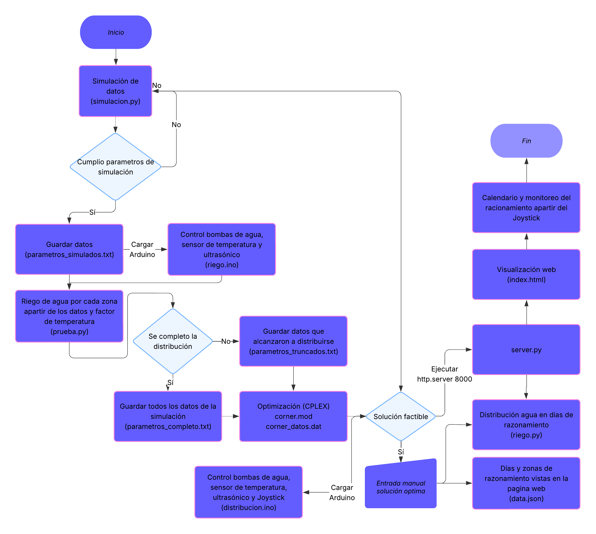

# Devid2005-AquaSmart-Integrated-Water-Rationing-System
AquaSmart is an integrated platform for data-driven water-rationing that combines Python-based simulation, MILP optimization in IBM ILOG CPLEX, Arduino mechatronic control, and real-time web visualization. The system was developed as a technical solution for urban water scarcity scenarios, using Bogotá’s 2025 drought as a real reference case.

Features
1. Simulation Module (Python)

• Generates multi-zone water consumption scenarios
• Incorporates temperature and sector-based demand patterns
• Produces structured parameter files for the optimization stage

2. MILP Optimization (CPLEX)

• Mixed-Integer Linear Programming model for equitable rationing
• Computes optimal supply/cut schedules per zone
• Works with complete or truncated simulation inputs

3. Arduino-Based Physical Prototype

• Real-time control of pumps, solenoid valves, ultrasonic sensors and temperature sensors
• Joystick-based manual day advancement and overrides
• Validates physical feasibility of optimized distribution plans

4. Python–Arduino Communication

• Serial communication for synchronized execution
• Continuous logging of readings and operational events
• Ensures physical execution matches optimized decisions

5. Real-Time Web Dashboard

• Backend implemented using Flask
• Front-end built with HTML, CSS, and JavaScript
• Displays reservoir levels, zone states, daily changes, and optimization results
• Includes event console and dynamic color-coded real-time table

Repository Structure

AquaSmart-Integrated-Water-Rationing-System/
• simulation/ — simulacion.py, prueba.py
• optimization/ — corner.mod, corner_datos.dat
• arduino/ — riego.ino, distribucion.ino
• control/ — riego.py
• web/ — server.py, index.html, static assets
• data/ — parametros_simulados.txt, parametros_completo.txt, parametros_truncados.txt, data.json

System Flow

The complete execution pipeline of the system is represented in the flow diagram below:

This diagram illustrates how AquaSmart operates internally:
simulation → feasibility validation → MILP optimization → Arduino-based execution → real-time web monitoring.

The physical and electronic architecture of the prototype, which uses an ultrasonic and temperature sensor, water pumps, and a joystick, is shown in the following circuit diagram:

This circuit represents the actual hardware implementation used to execute the rationing calendar computed by the optimization model.
AquaSmart_CODE/images/circuito.png
Requirements

Python: Python 3.10+, Flask, PySerial, optional NumPy/Pandas
Arduino: Arduino IDE and required sensor libraries
Optimization: IBM ILOG CPLEX 12.10+
Browser: Chrome or Firefox

Installation and Execution
1. Clone the repository

git clone https://github.com/Devid2005/Devid2005-AquaSmart-Integrated-Water-Rationing-System.git

cd AquaSmart-Integrated-Water-Rationing-System

2. Run simulation

python simulacion.py

3. Validate distribution

python prueba.py

4. Solve MILP model

Load corner.mod and corner_datos.dat into IBM ILOG CPLEX and run the model.

5. Upload Arduino firmware

Upload riego.ino for initial validation.
Upload distribucion.ino for final optimized execution.

6. Initialize the local server

Before running server.py, start a local HTTP server in the folder containing the web files:
python -m http.server 8000

After this, you may execute the Flask server:
python server.py

Now the interface can be viewed through:
http://localhost:8000

or directly through server.py depending on your setup.

7. Execute the daily distribution

python riego.py

8. Open the real-time dashboard

Open index.html in your browser to visualize levels, states and events.

Case Study: Bogotá 2025 Water Crisis

AquaSmart replicates real consumption patterns and reservoir behavior observed during Bogotá’s 2025 drought. Results show:

AquaSmart_CODE/images/results.png

• A 25–30% reduction in total water consumption compared to no-rationing scenarios
• Progressive recovery of reservoir levels
• Enforcement of fairness constraints (no zone experiences more than two consecutive rationing days)
• High agreement between theoretical predictions and physical prototype measurements
• Full synchronization between simulation, optimization, Arduino execution and digital visualization

Author

David Santiago Hernández Hernández
School of Engineering, Science and Technology
Universidad del Rosario — Bogotá, Colombia

